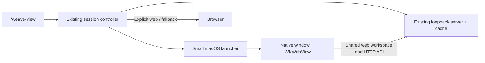

# Weave workspace — browser facelift first, dedicated window second

Date: 2026-10-02; updated 2026-10-03. Status: Stage A browser workspace is implemented in PR #62 and ready for a user pass. Stage B dedicated macOS hosting remains proposed below.

## 1. Decision and scope

First give the existing browser viewer an note-first workspace: note tabs, per-tab navigation history, graph-as-a-tab, split panes, a clearer notes list, collapsible sidebars, and a visual facelift. Ship and validate that experience in the browser. Then add a dedicated macOS window around the same UI. Keep the agent session responsible for the local server. Reuse the existing reader, editor, graph renderer, search, and data APIs inside a revised shared web shell.

The user explicitly chose:

- A dedicated window launched by `/weave-view`, not an independently running knowledge application.
- macOS first; browser support remains available on other platforms.
- One roadmap covering the full experience, with the UI facelift first and dedicated window second. The browser facelift can ship independently.
- Preserve the graph's rendering, physics, colors, clustering, and position algorithms. Moving it into a tab or split pane changes its container, not its graph design.

“Standalone” in this plan describes the window: its own application identity, app switching, and native window controls. Closing the agent still stops its server. There is no detached server, background daemon, Dock-only workspace boot, or new knowledge store.

The first delivery is **the tabs, navigation, and pane behavior explored in the reference app, running in today's browser viewer**. The second adds application identity and native window behavior. Native hosting must not block or shape the initial UI work. Minimize implementation by sharing components and using a bounded pane model, rather than omitting the requested experience.

## 2. What was actually explored

The open reference was a desktop Markdown workspace, version 1.13.7, in a small vault containing `test` and `Welcome`. These are observations from interacting with the app, not assumptions from screenshots alone.

| Interaction tested | Observed behavior | Lesson for Weave |
| --- | --- | --- |
| Open another note from Files | The active note tab is replaced; the file list stays visible | Stable navigation around changing content matters more than ornamental chrome |
| Navigate back | Returned from `Welcome` to `test`; forward became available | History belongs to the reading workflow |
| Click New tab, then a file | A separate note tab opens beside the existing tabs | Tabs preserve working context rather than making every click a new tab |
| `Cmd+O`, type a title | A compact file switcher offers keyboard selection and visible shortcut hints | Fast navigation must stay one keystroke away |
| `Cmd+Enter` in the switcher | Opened a separate tab, including a duplicate of an already-open note | Opening a new context is an explicit action |
| Sidebar Search | Results remain in the left sidebar while the note remains visible | Navigation does not have to replace the document |
| Select Graph view | The graph occupies the central content area as a peer tab | Graph and notes can share a workspace without always sharing screen width |
| Open graph settings | Filters, Groups, Display, and Forces are tucked behind a control | Controls can stay secondary; this does not justify retuning Weave's graph |
| Split right | A second independently usable tab group appears | Useful for comparison, but substantially more than a window wrapper |
| Open in new window | A note opens in a native window with its own tab strip and controls | Window identity and content layout are separate concerns |

The visible shell also has a narrow action ribbon, Files/Search/Bookmarks sidebar modes, a vault identity at bottom left, and a quiet status area. The note occupies most of the remaining space. The reference window was approximately 1024×800; splitting it made each reading pane noticeably narrower.

The temporary split, extra tabs, and pop-out were closed, returning to the original graph and `test` tabs. No note bodies were edited. Search/history state was exercised. This was a usability exploration of a two-note vault, not a large-vault performance test, editing reliability audit, restart-persistence test, or plugin review.

## 3. What Weave already provides

Inspected baseline: local `main` at `a13d32c`. This is the local checkout, not a claim that all other branches or remote work are incorporated. In particular, it has no `src/opencode` directory; launcher wiring must be reconciled with that adapter if it lands before implementation.

Read `docs/design.md` first. Weave's distinguishing workspace remains human/agent knowledge plus repository knowledge, with plain files and explicit provenance. A desktop workspace shell should not turn the product into a separate notes database.

I also launched the existing viewer against a disposable vault, opened a note, inspected the tree/note/graph composition, and used the existing search to navigate to another note. The real vault was not used for this comparison.

| Existing implementation | Consequence for the combined workspace |
| --- | --- |
| `src/pi/viewer/web/run.ts`: one server/cache per session, with an in-flight boot guard | Reuse server ownership and startup deduplication |
| `src/pi/index.ts`: `session_shutdown` closes the server | Preserve this lifecycle; do not detach it |
| `src/web/server/server.ts`: `startWorkspaceServer`, loopback, ephemeral port | The helper receives a live entry URL; it does not boot another server |
| `src/web/server/security.ts`: token handoff, cookies, Host and Origin checks, CSP | Keep these protections and verify them in the actual native host |
| `src/web/client/shell/Shell.tsx`: tree/note/graph columns, selection, search, save/discard guards | Replace the fixed composition with tabs and panes; reuse its components and guards in one shared viewer |
| `src/web/client/workspace.ts`: two-second polling | Agent/file changes already become visible; no new watcher or sync service |
| `selection.storage.ts`, layout/theme storage, graph position storage | Existing continuity is tied to the web origin, including its port |
| `Shell.tsx`: `history.replaceState` mirrors selection | Browser back/forward does not currently provide note history |
| `Note.tsx`: explicit Edit/Save and sandboxed HTML artifact frames | Preserve editing semantics and preview isolation |
| `scripts/build-web.mjs`: committed browser bundle with drift checking | Keep a single web bundle for browser and desktop |

Some historical prose is stale: the README still describes click-to-edit, while the current source and running UI have an Edit button. This plan follows source and observed behavior. Likewise, older workspace comments mention SSE; the running implementation polls.

## 4. Stage A — browser workspace facelift

The default workspace is note-first. The graph is a peer tab, not a permanently competing third column. Initially this content lives in the existing browser tab; the macOS title bar comes only in Stage B:

```text
┌ Weave — project-name (existing browser tab)                   ┐
│ Notes  [Search… ⌘K]       [Note A ×] [Note B ×] [Graph] [+]     │
├───────────────────┬───────────────────────────┬───────────────┤
│ Vault             │ ← →  Note A              │ Context       │
│ ▾ Project notes   │                           │ Links         │
│   Note A          │ Roomy reading / editing   │ Backlinks     │
│   Note B          │ surface                   │ Tags          │
│ Repository        │                           │ Provenance    │
├───────────────────┴───────────────────────────┴───────────────┤
│ Workspace identity · connection / save status                 │
└───────────────────────────────────────────────────────────────┘

Split right:    Notes │ [Note A] [Note B] │ [Graph] │ Context
Split down:    the same two tab groups arranged vertically
```

This is a behavior sketch; refine spacing and visual hierarchy against the observed desktop workspace experience before implementing the shell. Use restrained borders, clear active tabs and note selection, readable note width, compact navigation, and quieter metadata. Keep Weave's identity and provenance visible. Validate at a desktop viewport around 1280×800 and smaller sizes. Rework responsive rules for the new composition: collapse sidebars and show only the active pane when two panes would be unusably narrow, retaining the hidden pane's state and an explicit pane-switch control.

### Notes, tabs, history, and search

- The left sidebar shows clearly separated vault and repository scopes, folders, readable titles, and a compact recents view. Reuse current traversal, filtering, and mutations. Keep one visible unified search; the local tree filter remains a list filter, not a competing retrieval mode.
- Clicking a note, wikilink, or search result opens it in the active note tab. An explicit new-tab action or modifier opens another tab. If the active tab is Graph, opening a note uses the last active note tab in that group, or creates one, preserving the Graph tab.
- Tabs have titles, active state, close controls, and unsaved indicators. Support explicit New tab, open in new tab, keyboard switching, and close. Support dragging tab titles between existing panes and dropping Files notes into either pane as new tabs; start without pinning, preview-tab modes, or arbitrary docking.
- Each document tab owns back/forward history and reading position. Back/forward traverses notes within that tab rather than navigating away from the app. New navigation after Back drops the forward tail; deleted targets get a useful missing-note state.
- Switching tabs preserves an unsaved draft. Replacing a tab's document, navigating its history, or closing its last view prompts before discarding a draft. Keep one draft per note identity across panes/tabs so opening the same note twice cannot create competing in-memory edits. External writes retain the existing last-writer-wins contract; do not overwrite an in-memory draft during a poll.
- Keep explicit Edit/Save and existing Markdown rendering. This change does not introduce inline preview editing or a new editor engine.
- Retire the global branding/search/status header. Tabs own the top row; a ribbon search button and `Cmd+K` open unified search. Theme and refresh live in the lower ribbon.
- Keep `Cmd+K` for unified search. Show an Open in new tab action and its shortcut in results. Context links follow the same navigation rules as the notes list and wikilinks.

### Graph and split panes

- Provide a visible Graph action that opens or focuses one Graph tab per workspace. The existing graph fills that tab's available area.
- Selecting a graph node first previews its title/type without leaving Graph. A second click or Open in new tab creates a document tab in the other pane when split, or the same group otherwise. The Graph tab remains available to return to, retaining camera and positions. Non-note repository nodes continue to use existing detail rendering.
- Support **Split right** and **Split down** through visible tab/menu actions. Use at most two tab groups initially, a resizable divider, and explicit Move to other pane / Close pane actions. A split can duplicate the current note view while sharing its draft. Closing a pane moves its tabs into the remaining group rather than discarding work. Closing or moving its last tab removes the empty split; the final workspace retains New tab.
- Clicking or focusing a pane makes it the destination for subsequent navigation. Context follows the active pane and selection, not whichever asynchronous request finished last.
- Keep one graph renderer instance per workspace. Do not run multiple force simulations because the user opened tabs. Preserve its state when inactive and notify it of container resizing when shown or moved; verify that hidden-container sizing cannot reset its camera or positions.
- Leave graph drawing, layout forces, colors, clustering, fit behavior, and position algorithms unchanged. Adapt only mounting, resizing, and selection routing needed by the new shell.

### Sidebars and browser controls

The notes sidebar and context sidebar are independently collapsible, with visible buttons, accessible labels, and keyboard access. Context reuses current links/backlinks/tags/provenance views. Keep the reader usable when either sidebar is hidden; do not bury navigation behind hover-only controls.

During Stage A, `/weave-view` continues opening the browser exactly as today. Use visible tab-close controls and Option W / Alt W for the guarded workspace close action. Codex’s in-app browser independently claims that shortcut and still closes its outer tab; do not promise to intercept browser-reserved `Cmd+W` or `Cmd+T`. Browser reload/close retains the existing unload protection. Native menu and window shortcuts belong to Stage B. No desktop-specific bridge is required to deliver the facelift.

## 5. Stage B — dedicated macOS window

After the browser workspace passes its acceptance checks, embed the same built web client in a dedicated window. Native work adds hosting, lifecycle, menus, and packaging; it must not require another UI rewrite. Start around 1280×800 constrained to the display, restore valid native bounds, and avoid reopening off-screen after a monitor is removed.

### Command behavior

| Command / situation | Proposed result |
| --- | --- |
| `/weave-view` on supported macOS | Start/reuse server, open/focus its dedicated Weave window |
| Repeated invocation in the same session | Focus the existing window; no reload, second server, or duplicate window |
| Invocation in another agent session | Separate session window; clear workspace title; no accidental workspace switching |
| `/weave-view web` | Explicit browser escape hatch on every platform |
| `/weave-view --no-open` or `web --no-open` | Preserve current URL-only behavior; launch nothing |
| `/weave-view tui` | Preserve current terminal viewer |
| Default invocation elsewhere | Preserve browser behavior |
| Missing/failed macOS helper | Open the existing browser path with a brief explanation; retain URL/TUI fallback |
| Non-interactive/headless session | Preserve current no-desktop-launch behavior |

No new `app` command, target picker, browser preference wizard, or automatic software installation is needed. A packaged helper should be available through the normal supported installation path. Failure to start the helper must not take away the working viewer.

### Window and interaction contract

- Native title bar, traffic lights, resize, minimize, full screen, Mission Control, and `Cmd+Tab` identity.
- Title identifies Weave and the workspace; it never contains the authentication token.
- Existing `Cmd+K` search, note editing, `Cmd+S`, focus shortcuts, text selection, copy/paste, and undo/redo continue working. Provide standard native Edit menu/responder behavior; do not steal editor shortcuts.
- `Cmd+W` closes the active tab; after the last tab it closes/hides the window. Native window close checks all drafts. On an accepted window close, retain live workspace state off-screen while its session remains active; `/weave-view` shows it again without reloading. If retaining a hidden WebView proves costly, measure before adding a pause/resume protocol.
- `Cmd+Q` quits the viewer helper after the same draft protection; it does not terminate Pi or its server. A later `/weave-view` can recreate the helper. Recreating the helper need not restore an unsaved draft.
- External HTTP(S) links open in the normal browser. Internal note links stay inside Weave. An external URL must never replace the privileged application surface. Unsupported URL schemes are denied rather than passed blindly to the OS.
- Implement the notes list, unified search, tabs, history, splits, and sidebars above in the shared web client. Browser users receive the same improved workspace.
- Native menu actions and web shortcuts route through the same workspace actions. Test editor shortcut precedence rather than installing duplicate global handlers.

### Session ending and draft safety

The helper must not be force-killed during `session_shutdown`: doing so could destroy an unsaved draft. When the server/session ends, show a clear “Session ended — run /weave-view in your agent to reconnect” state while retaining the document and any editable draft for copying. A save to a stopped server must fail visibly, never report success. Closing this state still respects draft protection.

A clean hidden helper can exit when its owning session ends. A visible window or dirty draft can remain until the user closes it. A new session opens its own window; automatic migration of a draft to a different server is out of scope.

The exact close/quit implementation is a prototype gate. JavaScript `beforeunload` alone must not be assumed to guard native window destruction. If WKWebView needs a bridge, expose only draft status and a guarded close request from the trusted main frame, reusing the existing editor state. Do not expose filesystem access or a general native command API.

### Host choice

The richer tab/pane UI remains web code in either host; it does not require native tabs or a different web framework. Defer the host decision and prototype until Stage B. The current candidate is a small AppKit + WKWebView helper, with Electron as the alternative if native integration becomes complex. Verify the completed browser workspace's keyboard, focus, draft, and graph behavior before choosing. No native scaffolding or dependencies are needed in Stage A.

| Option | Fit for the agreed scope | Decision |
| --- | --- | --- |
| Safari Add to Dock / installed web app | Very little code, but saves a URL while Weave uses per-session ports/tokens; manual installation and focus/lifecycle control do not match `/weave-view` | Useful reference, not the shipping integration |
| Browser app-mode launch | Could remove browser chrome, but depends on a particular installed browser and its profiles/launch behavior | Not the default product contract |
| AppKit + WKWebView | Uses macOS system components, hosts the shared workspace, adds no Node/Chromium runtime to the extension | Preferred prototype for the first macOS delivery |
| Electron | JavaScript/TypeScript host and consistent bundled browser engine; larger distribution and another runtime to maintain | Fallback if native hosting cannot preserve behavior simply |
| Tauri | Cross-platform host with system WebViews, but adds Rust/toolchain/plugin packaging to a macOS-only wrapper | Defer; no current need justifies it |

Apple documents the [Safari web-app behavior](https://support.apple.com/en-gb/104996) and WKWebView [website data stores](https://developer.apple.com/documentation/webkit/wkwebsitedatastore). Tauri documents its [platform-specific engines](https://v2.tauri.app/reference/webview-versions/). Electron supplies explicit [window APIs](https://www.electronjs.org/docs/latest/api/browser-window) and [application lifecycle APIs](https://www.electronjs.org/docs/latest/api/app).

The preference for native here is an engineering judgment from the agreed scope, not a measured claim that WKWebView will run Weave better. No native wrapper was built during this research. Cookie handling, WebGL behavior, packaged launch, and native draft protection remain unverified.

If the prototype needs graph algorithm changes, weakened security, private Apple APIs, or substantial custom browser infrastructure, stop the native approach and reassess Electron. Do not prioritize a tiny binary at the expense of a complicated product. Do not maintain both native and Electron wrappers.

## 6. Technical shape and stage boundaries

Stage A uses the existing command → session controller → loopback server → browser path. It changes the shared web shell and presentation-state persistence. The diagram below is the later Stage B addition, not a prerequisite for the facelift.



Use one helper process per agent session initially. It owns one window, not one process per note. Keep its handle in the existing controller. A narrow parent/helper control channel can carry open/focus and session-ended events and report ready/closed/failure; use it rather than a globally listening control server or public URL scheme. Treat a successful spawn as insufficient: wait for a bounded ready/failure result before reporting that the window opened.

Deliver launch context over that private channel rather than placing tokens in persistent preferences or log output. Resolve the helper path relative to the installed package, never the user's working directory. Keep macOS-specific code outside `src/core/` and all host imports out of the web client. Browser launch still uses the existing harness-owned path; native process creation must preserve the harness's launch/trust expectations rather than silently bypassing them.

### Shared workspace state — Stage A

Replace the single-selection shell model with a small explicit workspace state: one or two pane groups, ordered tabs and active tab per group, active group, document history/scroll per tab, and drafts keyed by note identity. Keep one polling/cache owner for the workspace. Reuse the existing note/detail components with the selected document for their pane; do not mount a separate complete `Shell` for every tab.

Scope asynchronous note loads by document/tab and reject stale results, so a slow request cannot replace the newly active document or context. Share successful saves and polled data across views of the same note while preserving dirty drafts. Persist only serializable presentation state, not network handles or renderer objects. This is a small state model for the defined behavior, not a generic docking framework.

### Native authentication and isolation — Stage B

- Continue loading the server's authenticated entry URL through the existing handoff. Check the actual cookie round trip: `Secure` / `__Host-` behavior on HTTP loopback is a compatibility risk, regardless of optimistic comments in the source.
- Each session gets an isolated WebView data store. Cookies are host/path scoped rather than port scoped, so sharing one cookie jar across multiple loopback servers can overwrite their same-named authentication cookies.
- Use an in-memory per-session WebView data store for authentication isolation. Retain it while the session is alive; durable presentation-state restoration is handled separately below, without retaining authentication tokens.
- Retain CSP, Host/Origin checks, authenticated writes, and the HTML artifact sandbox. Do not disable them to make embedding work.
- Main-frame navigation is restricted to the assigned workspace origin. Preserve legitimate internal artifact subframes. Handle new-window links through the same external-link policy.
- Implement native JavaScript alert/confirm presentation where needed; Apple exposes this through [WKUIDelegate](https://developer.apple.com/documentation/webkit/wkuidelegate/webview(_:runjavascriptconfirmpanelwithmessage:initiatedbyframe:completionhandler:)). Only the trusted main frame can use any desktop bridge.

If Electron is selected instead, use sandboxing, context isolation, no renderer Node integration, narrow navigation, and validated IPC, following its [security guidance](https://www.electronjs.org/docs/latest/tutorial/security). Session storage still needs isolation.

### Workspace restoration — Stage A, native bounds in Stage B

Include durable web workspace restoration with the facelift: open document/Graph tabs, active pane/tab, split orientation and ratio, sidebar visibility/widths, theme, and reading positions. Key it by canonical vault root plus repository root (or the working directory when no repository exists), not the ephemeral port. Restore only valid targets; missing notes are handled without breaking the remaining workspace. Stage B adds native window geometry independently.

Use a small authenticated server read/write endpoint over a local presentation-state JSON file outside the vault and derived repository index, so the shared web client can restore state in both browser and desktop. Use atomic replacement and validated bounded input. Preserve existing traversal protections and never accept arbitrary filesystem paths from the renderer. Store per-view snapshots under the workspace identity so simultaneous agent sessions do not continuously overwrite one another; a new session starts from the most recently saved snapshot, and existing sessions do not live-sync their layouts. Bound retained snapshots.

Restore UI state, not login tokens or unsaved text. Drafts survive live tab/pane switching and guarded close operations, but crash recovery and durable draft recovery are outside this delivery. Keep current graph position caching separate; do not change its algorithm or promise graph-camera restoration across new sessions. Browser and desktop still read and write the same knowledge files.

## 7. Packaging and likely change footprint

Candidate locations, to be finalized after the prototype:

| Location | Work |
| --- | --- |
| `native/macos/` | Small Swift/AppKit helper, app metadata, existing-brand icon, native smoke checks |
| `scripts/` and macOS release workflow | Reproducible helper build and packaging/signing checks |
| `src/desktop/` | Harness-independent launcher/process lifecycle, kept out of core and browser bundles |
| `src/pi/viewer/web/run.ts` | Select native default on macOS, reuse/focus helper, fallback, session shutdown |
| `src/pi/index.ts` and command tests | Distinguish bare default from explicit `web`; preserve `tui` / `--no-open` |
| `src/web/client/shell/` and workspace state/loading | Tab groups, history, active-pane routing, splits, sidebar composition, restoration, native draft/session integration |
| `src/web/client/tree/`, `note/`, `search/`, and existing styles | Notes-list facelift, shared draft/view wiring, new-tab actions, readable spacing and accessible controls |
| `src/web/client/graph/Graph.tsx` integration boundary | Container lifecycle, resize, and selection callback wiring only; preserve renderer/physics algorithms |
| `src/web/server/` and a small presentation-state store | Authenticated workspace snapshot persistence separate from knowledge data |
| Package manifest, README, existing viewer tests | Include the helper artifact and describe the real lifecycle |

No planned changes to graph renderer/physics algorithms, graph dependencies, note format, search ranking, or repository indexing. Graph component wiring can change where tab/pane hosting requires it. Existing `src/core` APIs remain the data engine.

Ship a prebuilt helper for supported Macs, built in CI. Prefer a universal macOS artifact if the build supports the chosen minimum OS; otherwise publish clearly selected architectures. Users should not need Xcode, Swift tooling, Electron, or a postinstall compiler. Verify executable permissions and the actual `npm pack` artifact. Do not silently download executable code on the first command invocation.

A distributable macOS helper needs an explicit Developer ID signing/notarization path and clean-machine verification; Electron Forge's [macOS signing guide](https://www.electronforge.io/guides/code-signing/code-signing-macos) also describes the relevant distinction between signing and notarization. A local development build does not prove an installed release launches successfully. Availability of signing credentials was not inspected and must be checked before promising a frictionless release.

## 8. Implementation sequence and exit criteria

Stage A is independently shippable. Complete and review it before starting native-host implementation.

1. **A1 — Workspace layout and visual direction.** Make a reviewable browser mockup for note, graph, and split layouts using existing components and observed desktop workspace patterns. Define active, dirty, empty, collapsed, and narrow-window states. Exit: the composition provides the requested note-first experience and leaves graph visuals intact.
2. **A2 — Tabs, history, and drafts.** Implement the small workspace state, shared drafts, document history, scroll continuity, and unified open actions. Exit: switching preserves drafts, closing/replacing protects them, and stale fetches cannot corrupt another tab.
3. **A3 — Graph tab, splits, and sidebars.** Support two resizable tab groups, graph navigation, context following focus, collapsible sidebars, and keyboard-accessible controls. Exit: note–note and note–graph comparisons work without duplicate graph simulations or cross-pane selection leaks.
4. **A4 — Restoration and browser validation.** Add bounded workspace snapshots and finish responsive layout and visual polish. Exercise actual reading/editing workflows in the browser, run project checks, and provide a manual user pass. Exit: tabs/layout/reading positions restore across server ports; drafts and graph behavior remain correct. The browser facelift can ship here with no desktop runtime dependency.
5. **B1 — Native-host compatibility prototype.** Host the completed web workspace in WKWebView using a disposable vault. Verify cookies, reads/writes, graph rendering/pan/zoom/selection, tab/pane focus, shortcuts, dialogs, draft-safe native close/quit, and artifact previews. Exit: native hosting preserves behavior without weakened protection or graph changes; otherwise reassess Electron.
6. **B2 — Session launcher and native usability.** Integrate command routing, readiness, focus reuse, fallback, session-end behavior, title/icon, menus, native bounds, and external links. Exit: repeated invocations reuse one window, sessions remain isolated, and all native exits protect drafts.
7. **B3 — Packaged desktop validation.** Build/sign/package the helper and test the installed artifact from another working directory and on a supported clean Mac. Exit: no developer tools needed, the same UI works in browser and desktop, and fallback paths remain usable.

Keep implementation on a feature branch. Follow existing test frameworks and the ≥95% TypeScript coverage gates; do not lower thresholds for desktop work. Native behavior additionally requires native checks and real-window smoke tests—it is not measured by Vitest's TypeScript coverage. Run `npm run check` and rebuild the committed web bundle from the changed source. Keep the existing untracked `docs/growth-plan.md` untouched.

### Acceptance matrix

Use browser/workspace rows to gate Stage A. Native launch, process isolation, native close, helper failure, and installed-helper rows gate Stage B; they must not delay a passing browser facelift.

| Case | Required result |
| --- | --- |
| macOS first/default launch | Dedicated branded window, successful authenticated load |
| Same-session repeated and concurrent launch | One window focused, one server, unchanged active note/draft |
| Two sessions, same or different repository | Isolated cookies and lifecycle; neither breaks the other |
| Open/current/new tab and tab-local Back/Forward | Predictable destinations and history; no unintended tab proliferation |
| Switch tabs/panes while editing; open same note twice | One preserved draft per note; both views stay coherent |
| Late fetch after tab switch or close | No stale response replaces the active document or context |
| Split right/down, resize, move tab, close pane | Two usable groups; closing a pane preserves its tabs and drafts |
| Graph in tab and split pane, hide/show/resize | Original graph behavior and positions; one renderer; selection routes predictably |
| Sidebar collapse, keyboard focus, narrow window | Notes remain usable; hidden panes retain state and are reachable |
| Restart server on another port | Valid tabs/layout/reading positions restored without stored tokens |
| Missing notes or malformed saved state | Remaining workspace restores safely; no arbitrary file access |
| Native close / `Cmd+W` / `Cmd+Q` / reload with dirty note | Cancel preserves text; accepted discard is deliberate |
| Save failure / server stopping during save | No false success; draft remains recoverable in the open window |
| Agent shutdown while editing | Visible ended-session state; no forced draft destruction |
| Close/reopen in a live session | Existing context restored without duplicate polling/renderers |
| Agent writes a note on disk | Existing polling shows it without manual reload |
| Graph and artifact preview | Same graph behavior, safe sandboxed previews |
| External and unsupported links | Safe browser handoff or rejection; no arbitrary native execution |
| Helper absent, crashes, or never becomes ready | Bounded failure, useful message, working browser fallback |
| Explicit web, URL-only, TUI, Linux/Windows, headless | Existing supported paths keep working |
| Installed package / spaces and Unicode in paths | Helper and web bundle resolve independently of current directory |

Record browser workspace responsiveness during Stage A and native cold-open time, idle memory, and graph interaction responsiveness during Stage B. Avoid promising a binary size or performance improvement before measuring.

## 9. Deliberate boundaries

Tabs, history, graph-as-a-tab, two-pane splits, the notes-list/visual facelift, collapsible sidebars, and workspace restoration all belong to Stage A in the browser. The dedicated macOS window, native lifecycle, and packaging follow in Stage B.

Still outside this roadmap: graph redesign or force retuning; an independent server/daemon; Windows/Linux native packages; arbitrary nested docking; detachable per-note OS windows; pinned/preview tabs; named saved layouts; plugins/themes infrastructure; a new Markdown editor; and crash-recoverable draft storage. These can be evaluated later without making the requested workspace a generic application framework.

## 10. Current outcome

Stage A is implemented on `codex/weave-workspace-facelift`: note-first shell, document tabs and history, shared in-memory drafts,
single Graph tab, two resizable pane groups, collapsible sidebars, bounded per-view workspace snapshots, and responsive composition.
Graph drawing and physics remain unchanged; node-click routing separates preview from opening. Browser and automated validation are recorded in `workspace-facelift-todos.md`.
A manual user browser pass is the remaining product review before Stage B native-host prototyping. No desktop helper or runtime
dependency is included in this browser change.
